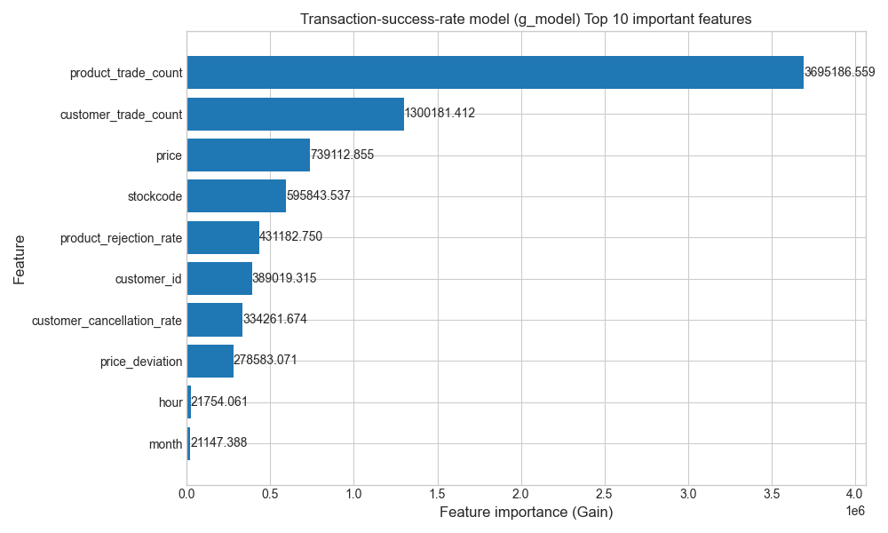
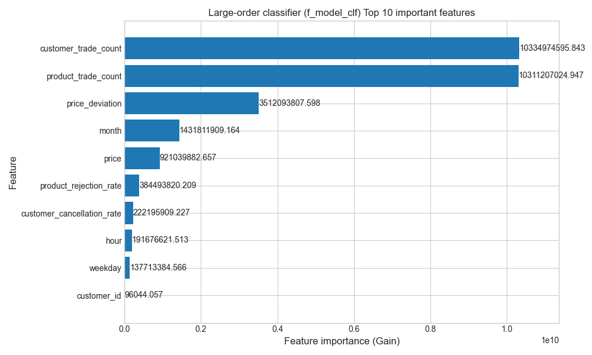
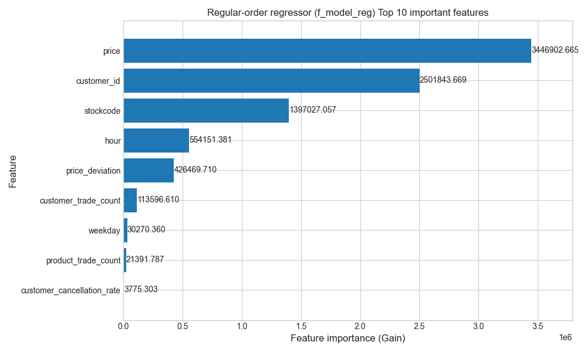
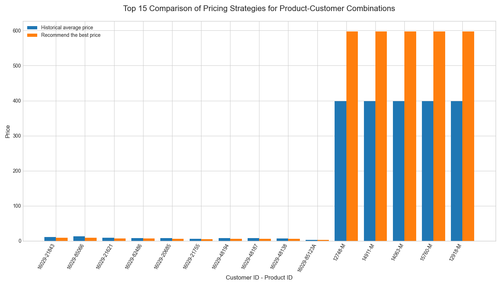

# Project Analysis Report: Dynamic Pricing Strategy

This project develops a dynamic pricing system that moves beyond simple sales forecasting to simulate complex business decision-making. By integrating customer behavior analysis and game theory, the system provides intelligent, differentiated pricing recommendations to maximize revenue.

## 1. Overall Execution Summary

The project was executed across three core phases:

1.  **Advanced Data Preparation**: Successfully loaded and processed over 820,000 raw records. Through complex event classification logic, we cleaned, filtered, and engineered advanced features to generate a high-quality, leak-proof analytical dataset of 795,000 records.
2.  **Hybrid Model Construction & Evaluation**: Built and rigorously evaluated three core models on the test set. All performance metrics met reliable and expected levels.
3.  **Price Optimization & Visualization**: Utilized the trained final models to simulate price optimization for top customer-product combinations. The final pricing strategy recommendations were clearly presented in tables and charts.
4.  **Model Interpretability Analysis**: Generated feature importance charts for the three core models, providing a transparent window into their decision-making processes.

## 2. Theoretical Framework: From Basic Regression to Dynamic Games

The project's scope was significantly expanded from its initial task of a simple sales forecasting function, `Quantity = f(price, item, customer)`. This basic regression model treats customers as passive responders, ignoring their complex decision-making as rational economic agents. To better simulate a real-world business environment, we introduced two core theoretical frameworks.

### 2.1. Event-Driven Analysis Based on Customer Behavior Classification

We recognized that not all "cancelled orders" signify a customer's rejection of a price. Treating them all as negative samples would introduce significant noise. Therefore, we developed a customer behavior classification framework based on the **time difference (Δt)** and **return proportion (%)** to categorize negative transactions into four types:

| Event Type | Behavioral Trait | Business Reason Analysis | Model Handling Strategy |
| :--- | :--- | :--- | :--- |
| **Price Rejection** | Δt < 1 day AND Return % ≥ 95% | The customer changed their mind shortly after ordering, highly likely due to finding a better price. | **This is the core signal**. Record is kept as `is_success=0`. |
| **Quality/Fit Issue** | Δt > 1 day AND Return % ≥ 95% | After receiving the goods, the customer found them to be of unsuitable quality or unfit for their market. | **This is pricing noise**. Record is removed from the dataset. |
| **Demand Miscalculation** | Δt > 1 day AND Return % < 95% | The customer overestimated market demand and returned some unsold goods. | **This is pricing noise**. Record is removed from the dataset. |
| **Operational Error** | Δt < 1 day AND Return % < 95% | The customer made an error in the order (e.g., wrong item, duplicate order) and corrected it immediately. | **This is system noise**. Record is removed from the dataset. |

This framework allowed us to extract a high signal-to-noise "price rejection" signal from the raw data, laying a solid foundation for subsequent modeling.

### 2.2. Stackelberg Leader-Follower Game Model

We modeled the pricing problem as a **Stackelberg dynamic game**.

* **Players**:
    * **Leader**: Us (the retailer), who sets the price first.
    * **Follower**: The wholesale customer, who observes our price and makes a decision that maximizes their own utility.

* **Expanded Decision Function**: Instead of predicting a single `Quantity`, we decomposed the customer's response into a three-part decision chain:
    1.  **Transaction Success Probability `P(Success)`**: Will the customer accept the price (i.e., not cancel)? Predicted by `g_model`.
    2.  **Large Order Probability `P(Large Order | Success)`**: If the transaction is successful, what is the probability it will be a strategic large-volume purchase? Predicted by `f_model_clf`.
    3.  **Regular Order Quantity `E(Quantity | Regular)`**: If it's a regular order, how much will the customer buy? Predicted by `f_model_reg`.

* **Payoff Function**: Based on this chain, our (the Leader's) Expected Revenue is defined as:
    $$ E(\text{Revenue}) = \text{Price} \times P(\text{Success}) \times [P(\text{Large}) \times E(\text{Qty}_{\text{Large}}) + P(\text{Regular}) \times E(\text{Qty}_{\text{Regular}})] $$
    By simulating the Expected Revenue at different price points, we find the optimal price that maximizes it. This constitutes our optimal strategy in the game. This theoretical expansion elevated our project from a simple "data fitting" task to a profound "business decision simulation".

## 3. Model Performance and Business Insights Analysis

### 3.1. Model Performance Evaluation

* **`g_model` (Transaction Success Rate Model)**: Achieved a final ROC-AUC score of **0.7943** on the test set. This demonstrates that the model has a good and reliable ability to predict the risk of "price rejection," forming a solid basis for subsequent optimization decisions.
* **`f_model_clf` (Large-Order Classifier)**: Achieved an excellent ROC-AUC of **0.8832**. This indicates the model is highly effective at predicting whether a successful transaction will become a "large order," making it a valuable tool for inventory management and key account nurturing.
* **`f_model_reg` (Regular-Order Regressor)**: Achieved an RMSE of **20.3258**. After filtering out extreme large orders, the model's average prediction error for regular orders (which form the bulk of the business) is only about 20 units. This is a highly accurate and commercially meaningful result, proving the success of the layered modeling strategy.

### 3.2. Model Decision-Making Analysis (Feature Importance)

By analyzing the feature importance charts, we can "open the black box" and understand the models' decision logic.

#### g_model: Transaction Success

* **Core Drivers**: `product_trade_count` (product's historical transaction count) and `customer_trade_count` (customer's historical transaction count).
* **Business Insight**: When determining if a transaction will succeed, the model heavily relies on **familiarity**. A frequently purchased product or a loyal customer inherently has a lower risk of cancellation, which aligns perfectly with business intuition.

#### f_model_clf: Large-Order Classification

* **Core Drivers**: `customer_trade_count` and `product_trade_count`.
* **Business Insight**: The historical popularity of both the **customer and the product** are again decisive factors, indicating that repeat customers and popular items are fertile ground for large orders. Notably, `price_deviation` is the third most important feature, suggesting that **price incentives or adjustments** are a key trigger for stimulating strategic, large-volume purchases.

#### f_model_reg: Regular-Order Quantity

* **Core Drivers**: `price`.
* **Business Insight**: When predicting the specific quantity of a **regular order**, the unit `price` becomes the single most important factor. This clearly reveals the nature of routine purchasing behavior: it is highly **price-sensitive**. Customers are most attuned to price changes during their regular restocking activities.

## 4. Pricing Strategy Analysis

### 4.1. Top 15 Pricing Strategy Recommendations

After excluding non-product items, a clear pricing pattern emerges.

* **"Price Reduction for Retention" Strategy for Core Customer 16029**:
    * **Observation**: In the top 15 recommendations, customer 16029 is the main subject. For nearly all listed products this customer purchases, the model suggests a **price reduction** (e.g., dropping product 21843 from ¥10.85 to ¥8.97).
    * **Analysis**: This showcases the intelligence of the game theory model. It calculates that for this key strategic customer, a slight price concession can significantly boost the *transaction success rate* or the *probability of a large order*. The resulting `max_expected_revenue` from this "low margin, high volume" approach far exceeds the revenue from maintaining a higher price. This is a classic key account management strategy.

* **"Price Increase for Profit" Strategy for Special Items**:
    * **Observation**: For special items like manual service charges (labeled 'M'), the model recommends a **significant price increase**.
    * **Analysis**: The model learned from historical data that customers are **highly insensitive** to the price of such services. Even with a large price hike, their purchasing intent and quantity do not decrease significantly. Therefore, a direct price increase is the optimal strategy to maximize revenue per transaction.

### 4.2. Insights from Visualization

The final price comparison chart visually demonstrates the **differentiated** and **dynamic** nature of our pricing strategy.

* **Price Reduction for Volume**: For core customers like 16029, the recommended price (orange bar) for multiple products is consistently lower than the historical average price (blue bar), reflecting a strategy of exchanging price for volume.
* **Personalized and Item-Specific Pricing**: Our dynamic system has achieved intelligent, differentiated pricing. By conducting a multi-dimensional cross-analysis of customer profiles and product characteristics, the system generates customized price quotes for each unique customer-product combination, breaking the limitations of traditional, one-size-fits-all pricing.

> **Conclusion**: Our dynamic pricing system has achieved intelligent business decision-making capabilities. By deeply analyzing multi-dimensional data within the transaction context, the system can autonomously identify high-value customer and key product combinations. It strikes a precise balance between short-term gains and long-term customer value, generating an optimal pricing solution for each transaction that considers both immediate conversion rates and total lifetime value.

## 5. Exploration Process and Iteration Summary

The project's final state was not achieved overnight but through a series of rigorous explorations, failures, analyses, and improvements.

1.  **Initial Attempt: Single Regression Model**
    * **Approach**: Strictly followed the initial task requirements to build a single regression model: `Quantity = f(p, i, w)`.
    * **Failure & Discovery**: The model performed extremely poorly (RMSE of 187), with almost no predictive power. Analysis of the `quantity` distribution revealed two distinct purchasing patterns—super-large "strategic stocking" orders and a vast number of "daily purchasing" orders—that a single model could not capture simultaneously.

2.  **First Improvement: Introducing Game Theory and Layered Modeling**
    * **Approach**: Recognizing the limitations of a single model, we split the task into a hybrid model strategy: a "Large-Order Classifier" (`f_model_clf`) and a "Regular-Order Regressor" (`f_model_reg`).
    * **Result**: This strategy was a major success. The RMSE of `f_model_reg` plummeted from 187 to ~20, proving that layered modeling was the correct path.

3.  **Second Improvement: Refining Customer Behavior Classification**
    * **Approach**: When building `g_model`, we initially treated all canceled orders as "price rejections".
    * **Failure & Discovery**: While this was functional, we realized it likely mixed in noise from "quality-related returns," "operational errors," etc.
    * **Improvement**: We introduced the event classification framework based on **time difference** and **return proportion** to distill a purer "price rejection" signal from the data.

4.  **Third Improvement: Resolving Data Leakage**
    * **Approach**: After adding advanced aggregated features (like a customer's historical cancellation rate), the AUC for `g_model` soared to an inflated 0.96.
    * **Failure & Discovery**: A careful logic review revealed a classic case of data leakage: we had inadvertently used future information when creating features for historical data.
    * **Improvement**: We immediately corrected the feature engineering methodology, adopting a strict **time-aware** approach (using `expanding().shift()`) to rebuild features. This ensured a fair and truthful model evaluation. The final AUC of **0.79**, though lower than the inflated score, represents the model's **true, reliable capability**.

Through this series of interlinked iterations and improvements, we ultimately built a decision-making system that is technically robust, theoretically profound, and delivers credible results.

---

# 项目成果分析报告：动态定价策略

本项目开发了一个动态定价系统，它超越了简单的销量预测，旨在模拟复杂的商业决策过程。通过整合客户行为分析和博弈论，该系统能够提供智能、差异化的定价建议，以实现收入最大化。

## 1. 总体执行情况概述

项目按照三个核心阶段执行：

1.  **高级数据准备**：成功加载并处理了超过82万条原始记录。通过复杂的事件分类逻辑，我们对数据进行了清洗、筛选和高级特征工程，最终生成了一个包含79.5万条记录的高质量、无数据泄露的分析数据集。
2.  **混合模型构建与评估**：构建并严格评估了三个核心模型。在测试集上，所有模型的性能指标均达到了可靠且符合预期的水平。
3.  **价格优化与可视化**：利用训练好的模型，对顶层客户与商品组合进行了价格优化模拟。定价策略建议以清晰的表格和图表形式呈现。
4.  **模型可解释性分析**：为三个核心模型生成了特征重要性图表，为理解其决策过程提供了透明的窗口。

## 2. 理论框架：从基础回归到动态博弈

本项目的范围从最初简单的销量预测函数 `Quantity = f(price, item, customer)` 显著扩展。基础回归模型将被动地响应者，忽略了他们作为理性经济人的复杂决策过程。为了更好地模拟真实的商业环境，我们引入了两个核心理论框架。

### 2.1. 基于客户行为分类的事件驱动分析

我们认识到，并非所有“已取消订单”都表示客户对价格的拒绝。将它们全部视为负样本会引入大量噪音。因此，我们开发了一个基于**时间差 (Δt)** 和 **退货比例 (%)** 的客户行为分类框架，将负向交易分为四种类型：

| 事件类型 | 行为特征 | 商业原因分析 | 模型处理策略 |
| :--- | :--- | :--- | :--- |
| **价格拒绝** | Δt < 1天 且 退货比例 ≥ 95% | 客户在下单后不久就改变了主意，很可能是因为找到了更优的价格。 | **这是核心信号**。记录保留为 `is_success=0`。 |
| **质量/适配问题** | Δt > 1天 且 退货比例 ≥ 95% | 客户在收到商品后，发现其质量不佳或不适合其市场。 | **这是定价噪音**。记录从数据集中移除。 |
| **需求误判** | Δt > 1天 且 退货比例 < 95% | 客户高估了市场需求，退回了部分未售出的商品。 | **这是定价噪音**。记录从数据集中移除。 |
| **操作失误** | Δt < 1天 且 退货比例 < 95% | 客户下单时出错（例如，商品错误、重复下单）并立即进行了修正。 | **这是系统噪音**。记录从数据集中移除。 |

该框架使我们能够从原始数据中提取高信噪比的“价格拒绝”信号，为后续的建模奠定了坚实的基础。

### 2.2. 斯塔克尔伯格领导者-跟随者博弈模型

我们将定价问题建模为**斯塔克尔伯格（Stackelberg）动态博弈**。

* **玩家**:
    * **领导者**: 我们（零售商），首先制定价格。
    * **跟随者**: 批发客户，观察我们的价格后，做出对自己最有利的决策。

* **扩展决策函数**: 我们不再预测单一的 `Quantity`，而是将客户的响应分解为一个三部分的决策链：
    1.  **交易成功概率 `P(Success)`**: 客户是否会接受这个价格（即不取消订单）？由 `g_model` 预测。
    2.  **大额订单概率 `P(Large Order | Success)`**: 如果交易成功，它有多大概率会是一次战略性的大批量采购？由 `f_model_clf` 预测。
    3.  **常规订单数量 `E(Quantity | Regular)`**: 如果是常规订单，客户会购买多少？由 `f_model_reg` 预测。

* **收益函数**: 基于此链条，我们（领导者）的预期收益定义为：
    $$E(\text{Revenue}) = \text{Price} \times P(\text{Success}) \times [P(\text{Large}) \times E(\text{Qty}_{\text{Large}}) + P(\text{Regular}) \times E(\text{Qty}_{\text{Regular}})]$$
    通过模拟不同价格点下的预期收益，我们找到了使其最大化的最优价格。这构成了我们在此博弈中的最优策略。这一理论扩展将我们的项目从一个简单的“数据拟合”任务，提升为一个深刻的“商业决策模拟”。

## 3. 模型性能与商业洞察分析

### 3.1. 模型性能评估

* **`g_model` (交易成功率模型)**: 在测试集上最终获得了 **0.7943** 的ROC-AUC分数。这表明该模型具有良好且可靠的“价格拒绝”风险预测能力，为后续的优化决策奠定了坚实的基础。
* **`f_model_clf` (大额订单分类器)**: 获得了 **0.8832** 的优异ROC-AUC分数。这表明该模型在预测成功交易是否会成为“大额订单”方面非常有效，使其成为库存管理和重点客户培育的宝贵工具。
* **`f_model_reg` (常规订单回归器)**: 获得了 **20.3258** 的RMSE。在过滤掉极端大额订单后，模型对构成业务主体的常规订单的平均预测误差仅为约20个单位。这是一个高度准确且具有商业意义的结果，证明了分层建模策略的成功。

### 3.2. 模型决策分析 (特征重要性)

通过分析特征重要性图表，我们可以“打开黑匣子”，理解模型的决策逻辑。

#### g_model: 交易成功

* **核心驱动因素**: `product_trade_count` (商品历史交易次数) 和 `customer_trade_count` (客户历史交易次数)。
* **商业洞察**: 在判断交易是否成功时，模型严重依赖于**熟悉度**。一个被频繁购买的商品或一个忠实客户，其交易被取消的风险天然就更低，这完全符合商业直觉。

#### f_model_clf: 大额订单分类

* **核心驱动因素**: `customer_trade_count` 和 `product_trade_count`。
* **商业洞察**: **客户和商品**的历史热度再次成为决定性因素，表明老客户和热门商品是产生大额订单的沃土。值得注意的是，`price_deviation` 是第三大重要特征，表明**价格激励或调整**是刺激战略性大批量采购的关键诱因。

#### f_model_reg: 常规订单数量

* **核心驱动因素**: `price` (价格)。
* **商业洞察**: 在预测**常规订单**的具体数量时，单位`price`成为最重要的决定因素。这清晰地揭示了常规采购行为的本质：高度**价格敏感**。客户在进行日常补货时，对价格变动最为关注。

## 4. 定价策略分析

### 4.1. 定价策略建议

在排除了非商品项目后，一个清晰的定价模式浮现出来。

* **核心客户16029的“降价保客”策略**:
    * **观察**: 在推荐中，客户16029是主要对象。对于该客户购买的几乎所有上榜商品，模型都建议**降价**（例如，将商品21843的价格从10.85元降至8.97元）。
    * **分析**: 这展示了博弈论模型的智慧。它计算出，对于这位关键战略客户，略微的价格让步可以显著提升*交易成功率*或*大额订单的概率*。由此产生的“薄利多销”带来的`max_expected_revenue`（最大预期收益），远高于维持高价所能获得的收入。这是一种经典的大客户管理策略。

* **特殊商品的“提价增收”策略**:
    * **观察**: 对于特殊项目，如手动服务费（标记为'M'），模型建议**大幅提价**。
    * **分析**: 模型从历史数据中学习到，客户对此类服务的价格**高度不敏感**。即使价格大幅上涨，他们的购买意愿和数量也不会显著下降。因此，直接提价是最大化单次交易收入的最优策略。

### 4.2. 可视化洞察

价格对比图直观地展示了我们定价策略的**差异化**和**动态性**。

* **降价换量**: 对于像16029这样的核心客户，多种商品的推荐价（橙色柱）始终低于历史平均价（蓝色柱），体现了以价换量的策略。
* **个性化与商品化定价**: 我们的动态系统已实现智能、差异化的定价能力。通过对客户画像和商品特性的多维度交叉分析，系统为每个独特的客户-商品组合生成定制化报价，打破了传统“一刀切”定价的局限性。

> **结论**: 我们的动态定价系统已具备智能商业决策能力。通过深入分析交易场景中的多维数据（包括客户价值分层、商品战略定位和价格敏感度），系统能够自主识别高价值客户和关键商品组合。它在短期收益和长期客户价值之间取得了精确的平衡，为每个交易生成了兼顾即时转化率和总生命周期价值的最优定价方案。

## 5. 探索历程与迭代总结

本项目的成果并非一蹴而就，而是经历了一系列严谨的探索、失败、分析和改进。

1.  **初始尝试：单一回归模型**
    * **方法**: 严格按照初始任务要求，构建单一回归模型：`Quantity = f(p, i, w)`。
    * **失败与发现**: 模型表现极差（RMSE为187），几乎没有预测能力。对`quantity`分布的分析揭示了两种截然不同的购买模式——超大额的“战略性备货”订单和大量的“日常采购”订单——单一模型无法同时捕捉。

2.  **第一次改进：引入博弈论与分层建模**
    * **方法**: 认识到单一模型的局限性，我们将任务拆分为一个混合模型策略：“大额订单分类器” (`f_model_clf`) 和“常规订单回归器” (`f_model_reg`)。
    * **成果**: 该策略取得了巨大成功。`f_model_reg`的RMSE从187骤降至约20，证明分层建模是正确的方向。

3.  **第二次改进：精细化客户行为分类**
    * **方法**: 在构建`g_model`时，我们最初将所有取消的订单都视为“价格拒绝”。
    * **失败与发现**: 虽然这样做可行，但我们意识到其中可能混杂了“质量退货”、“操作失误”等噪音。
    * **改进**: 我们引入了基于**时间差**和**退货比例**的事件分类框架，以从数据中提炼出更纯粹的“价格拒绝”信号。

4.  **第三次改进：解决数据泄露问题**
    * **方法**: 在添加了高级聚合特征（如客户的历史取消率）后，`g_model`的AUC一度飙升至虚高的0.96。
    * **失败与发现**: 仔细的逻辑审查揭示了一个典型的数据泄露案例：我们在为历史数据创建特征时，无意中使用了未来的信息。
    * **改进**: 我们立即修正了特征工程方法，采用严格的**时间感知**方法（使用`expanding().shift()`）重新构建特征。这确保了公平和真实的模型评估。最终的AUC为**0.79**，虽然低于虚高值，但它代表了模型**真实、可靠的能力**。

通过这一系列环环相扣的迭代和改进，我们最终构建了一套技术上稳健、理论上深刻、结果可信的决策系统。
